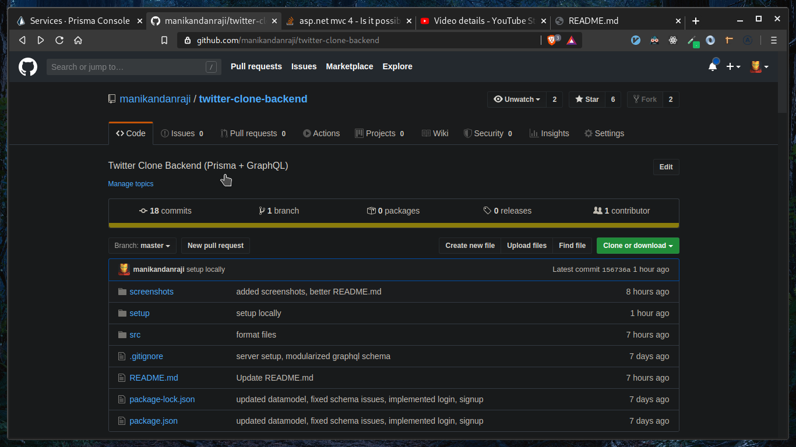

# Twitter Clone - Backend

Built with Prisma + GraphQL
If you are looking for the frontend repo, it lives here [frontend](https://github.com/manikandanraji/twitter-clone-frontend)

# The Stack

## Backend
1. Prisma - provides data modelling and a nice set of CRUD APIs to work with
2. GraphQLServer - graphql-yoga
3. Authentication - JWT 
4. Image upload - Cloudinary

## Frontend
1. Frontend - Our beloved React
2. State Management - ApolloClient (requests, updating UI, caching)
3. Styling - Styled Components
4. Routing - React Router
5. Notifications - React Toastify
6. Popups- Reactjs popup

# You can do these things
- Login / Signup
- New Tweet
- Like
- Retweet
- Comment
- View Profile
- Edit Profile
- Search by users, tags, people
- Toggle between light and dark mode
- Cycle through five different accent colors

# How to setup locally

- You need to have a prisma account
- Make sure to install the prisma globally in your machine 

	```bash
	npm i -g prisma

	# once you created your account, you can login from the terminal
	prisma login
	```
- Then have a look at this video if prisma sounds new to you.

[](https://youtu.be/Y71oeTYinRc "Twitter Clone backend setup")

# Deploying the backend to heroku

First create an heroku account and install the heroku cli globally and login

```bash
npm i -g heroku
heroku login
```

Once logged in, create a new heroku application and push it to the remote 'heroku'

```bash
heroku create
git push heroku master
```
Then we need to manually setup the environmental variables using the heroku dashboard

# Look at the UI

## Dark Mode


## Light Mode


## Mobile Layout


# TODO
- Real-time notifications using GraphQL subscriptions
- Bookmark tweeets
- Show retweets on user profile
- Show trending tags
- Better mobile support
- Add OLED theme
